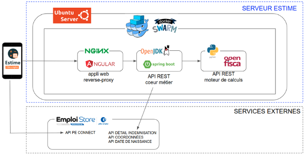

# [Startups d'Etat Pôle emploi] Estime - simulateur d'aides à la reprise d'emploi

La startup d'Etat _Estime_ est issue du challenge intraprenarial 2020 de Pôle emploi. 

### **L’idée :**

Proposer un simulateur qui permet aux demandeurs d’emploi de visualiser, sur une période de n mois, toutes leurs futures ressources financières en cas de reprise d’emploi (aides Pôle emploi, aides CNAF). Plus d'informations sur la [fiche startup de beta.gouv (Incubateur de services publics numériques)](https://beta.gouv.fr/startups/estime.html)

# [Architecture] Schéma simplifié de l'application Estime




L'application est composée de 3 composants applicatifs :

- frontend : application Web développée en Angular (Typescript) - ce projet Gitlab contient les sources de l'application Web
- backend coeur métier : api REST développée en Springboot (Java) - [lien projet Gitlab de l'api](https://git.beta.pole-emploi.fr/estime/estime-backend).
- backend moteur de calcul : api REST Openfisca développée en Python - [lien projet Gitlab de l'api](https://git.beta.pole-emploi.fr/estime/openfisca-france).


:closed_lock_with_key: L'accès au service Estime est **sécurisé par une authentification avec [PE Connect](https://peconnect.pole-emploi.fr/).**

# [Développement en local] Lancement de l'application Web Angular sur localhost

Ce projet a été généré avec [Angular CLI](https://cli.angular.io/) et utilise [npm](https://www.npmjs.com/) pour gérer les dépendances externes.

## Prérequis

Installation de NodeJS avec une **version 12.11.x minimum**. 

:thumbsup: Installer [NodeJS](https://nodejs.org/en/) avec un outil permettant de gérer plusieurs versions de Node (exemple : nvm). Plus d'informations, par [ici](https://docs.npmjs.com/downloading-and-installing-node-js-and-npm#using-a-node-version-manager-to-install-nodejs-and-npm).

Vérifier votre installation :

```console
foo@bar:~$ node -v
foo@bar:~$ npm -v
```

## Les étapes à suivre

1. Installer Angular CLI 

   ```console
   foo@bar:~$ npm install -g @angular/cli
   ```

1. Cloner le projet Gitlab **estime-frontend**

   ```console
   foo@bar:~$ git clone https://git.beta.pole-emploi.fr/estime/estime-frontend.git
   ```
1. Ouvrir le projet **estime-frontend** via votre IDE préféré

   :thumbsup: [VS Code](#ide-vs-code) est un IDE gratuit, légé et qui permet d'avoir un excellent confort de développement avec Angular

1. Installer les dépendances du projet

   ```console
   foo@bar:~estime-frontend$ npm install
   ```
1. Créer le fichier d'environnement local

   Créer un fichier nommé ***environment.local.ts*** dans **estime-frontend/src/environments**

   ```typescript
   export const environment = {
      production: false,
      /******** url de l'api coeur métier Estime ************/
      apiEstimeURL: '%% à renseigner %%',
      /******** OpenID Connect PE properties ************/
      peconnectClientid: '%% à renseigner %%',
      peconnectRedirecturi: 'http://localhost:4200/',
      peconnectScope: '%% à renseigner %%',
      peconnectIdentityServerURL: 'https://authentification-candidat.pole-emploi.fr',
      /******** url du script TagCommander (activation du taggage et du consentement Cookies)  ************/
      tagCommanderScriptUrl: ''
   };
   ```
   - **apiEstimeURL** : consulter la section [Appeler l'api coeur metier Estime](#appeler-lapi-coeur-metier-estime)
   - **OpenID Connect PE properties** : ces informations peuvent être récupérées en se connectant au compte Estime de l'[Emploi Store    
     Dev de Pôle emploi](https://www.emploi-store-dev.fr/portail-developpeur-cms/home.html;JSESSIONID_JAHIA=FE12476DF0564E5EE4269FD4FB9016E0).
   - **tagCommanderScriptUrl** : non renseigné car le taggage et le consentement Cookies n'est pas activé en localhost
  
1. Lancer l'application en exécutant la commande suivante :

   ```console
   foo@bar:~estime-frontend$ npm start
   ```


### Appeler l'api coeur metier Estime

Plusieurs possibilités :

- installer en local l'api

  1. suivre les instructions du **[README du projet Gitlab estime-backend](https://git.beta.pole-emploi.fr/estime/estime-backend)**
  1. renseigner le paramètre apiEstimeURL du fichier environment.local.ts comme ci-dessous :

     ```typescript
     export const environment = {
     production: false,
     /******** url de l'api coeur métier Estime ************/
     apiEstimeURL: 'http://localhost:8081/estime/v1/',
     [...]
     };
     ```
- se brancher sur l'api déployée sur l'environnement de recette

   Renseigner le paramètre apiEstimeURL du fichier environment.local.ts comme ci-dessous :

   ```typescript
   export const environment = {
      production: false,
      /******** url de l'api coeur métier Estime ************/
      apiEstimeURL: 'https://estime.beta.pole-emploi.fr/estime/v1/',
      [...]
   };
   ```

## [Tests e2e] Cypress

## [IDE] VS Code

VS Code est disponible en téléchargement sur le [site officiel](https://code.visualstudio.com/) 

:wrench:  Quelques extensions utiles que vous pourver installer dans votre IDE :

- Angular Language Service
- Angular Schematics
- Angular Snippets (Version 11)
- Angular template formatter
- HTMLHint
- HTML class snippets with Bootstrap4
- Bootstrap v4 Snippets
- SCSS Formatter
- TypeScript Hero
- vsc-organize-imports
- ESLint


