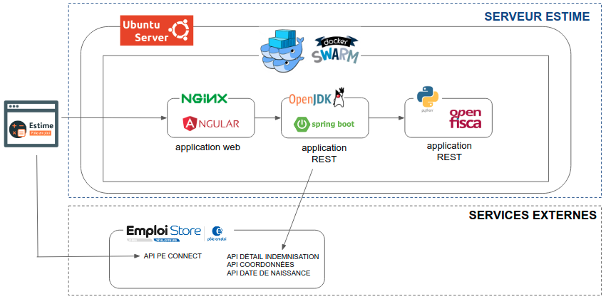

# [Startups d'Etat Pôle emploi] Estime - simulateur d'aides à la reprise d'emploi

### **L’idée :**

Proposer un simulateur qui encourage l'acte de reprise à l'emploi d'un demandeur d’emploi en lui offrant la possibilié de visualiser, sur une période de 6 mois, toutes ses futures ressources financières en cas de reprise d’emploi (aides Pôle emploi, aides CNAF). Plus d'informations sur notre démarche [https://beta.gouv.fr/startups/estime.html](https://beta.gouv.fr/startups/estime.html)

Accéder au simulateur : [https://estime.pole-emploi.fr/](https://estime.pole-emploi.fr/)

# [Architecture] Schéma simplifié de l'application Estime



- [Github application REST Springboot](https://github.com/StartupsPoleEmploi/estime-backend)  
- [Github application REST Openfisca](https://github.com/StartupsPoleEmploi/openfisca-france).


:closed_lock_with_key: L'accès au service Estime est **sécurisé par une authentification avec [Pôle emploi Connect](https://www.emploi-store-dev.fr/portail-developpeur/detailapicatalogue/-se-connecter-avec-p-le-emploi-v1?id=58d00957243a5f7809e17698).**

# [Code Source] Quelques explications

Ce projet est développé en [Typescript](https://www.typescriptlang.org/docs) avec le framework [Angular](https://angular.io/docs).

Ce projet a été généré avec [Angular CLI](https://cli.angular.io/) et utilise [npm](https://www.npmjs.com/) pour gérer les dépendances externes.

## Structuration du code source

- **./src/app/public :** composants publics, accessibles en non authentifié (homepage, cgu, etc...).
- **./src/app/protected :** composants privés, accessibles en authentifié (étapes de la simulation, etc...).
- **./src/app/commun :** composants communs, directives, guards, pipes, models
- **./src/app/core :** services Singleton
- **./docker :** fichier de configuration Docker
- **./cypress :** tests e2e

## Design du site - librairies utilisées

- [Bootstrap 4](https://getbootstrap.com/docs/4.1/components/alerts/) 
- [ngx-bootstrap.](https://valor-software.com/ngx-bootstrap/#/documentation).
- [Saas](https://sass-lang.com/guide), préprocesseur de CSS.

## Gestion des dépendances avec npm

Les mises à jour des dépendances du projet se font avec npm. Pour contrôler la mise à jour des versions, pas d'utilisation de ~  ou ^, il faut mettre à jour les versions manuellement. 

:wrench:  Outils pour aider à la mise à jour des librairies :

- [npm-check ](https://www.npmjs.com/package/npm-check)
- [npm-audi](https://docs.npmjs.com/cli/v6/commands/npm-audit)


# [Développement en local] Lancer l'application sur localhost

## Prérequis

Installation de NodeJS avec une **version 12.11.x minimum**. 

:thumbsup: Installer [NodeJS](https://nodejs.org/en/) avec un outil permettant de gérer plusieurs versions de Node (exemple : nvm). Plus d'informations, par [ici](https://docs.npmjs.com/downloading-and-installing-node-js-and-npm#using-a-node-version-manager-to-install-nodejs-and-npm).

Vérifier votre installation :

```console
foo@bar:~$ node -v
foo@bar:~$ npm -v
```

## Les étapes à suivre

1. Installer Angular CLI 

   ```console
   foo@bar:~$ npm install -g @angular/cli
   ```

1. Cloner le projet

   ```console
   foo@bar:~$ git clone https://git.beta.pole-emploi.fr/estime/estime-frontend.git
   ```
1. Ouvrir le projet via votre IDE préféré

   :thumbsup: [VS Code](#ide-vs-code) est un IDE gratuit, légé et qui permet d'avoir un excellent confort de développement sur Angular

1. Installer les dépendances du projet

   ```console
   foo@bar:~estime-frontend$ npm install
   ```
1. Créer un fichier nommé ***environment.local.ts*** dans **estime-frontend/src/environments** 

   - Copier le contenu suivant et valoriser les variables d'environnement en remplaçant **%% à renseigner %%** par les valeurs correspondantes. Récupérer les valeurs des variables d'environnement dans le projet Gitlab via le menu **Settings -> CI/CD -> Variables**
   - Consulter la section [Appeler l'api coeur metier Estime](#api-estime-backend-appeler-lapi-coeur-metier-estime), pour valoriser le paramètre **apiEstimeURL**. 
   <br />
   
   ```typescript
   export const environment = {
      production: false,
      /******** url de l'api coeur métier Estime ************/
      apiEstimeURL: '%% à renseigner %%',
      /******** OpenID Connect PE properties ************/
      peconnectClientid: '%% à renseigner %%',
      peconnectRedirecturi: 'http://localhost:9001/',
      peconnectScope: '%% à renseigner %%',
      peconnectIdentityServerURL: 'https://authentification-candidat.pole-emploi.fr',
      /******** url du script TagCommander (activation du taggage et du consentement Cookies)  ************/
      /** non renseigné car le taggage et le consentement Cookies n'est pas activé en localhost          **/
      tagCommanderScriptUrl: ''
   };
   ```

1. Lancer l'application en exécutant la commande suivante :

   ```console
   foo@bar:~estime-frontend$ npm start
   ```

# [API estime-backend] Appeler l'api coeur metier Estime en local

- installer en local l'api

  1. suivre les instructions du **[README du projet Gitlab estime-backend](https://git.beta.pole-emploi.fr/estime/estime-backend)**
  1. renseigner le paramètre apiEstimeURL du fichier environment.local.ts comme ci-dessous :

     ```typescript
     export const environment = {
     production: false,
     /******** url de l'api coeur métier Estime ************/
     apiEstimeURL: 'http://localhost:8081/estime/v1/',
     [...]
     };
     ```

# [Tests e2e] Cypress

## Structuration des tests

**Utilisation du pattern "Page Object"** avec une page représentée par une classe.

- **./cypress/integration/integration :** contient les classes implémentant la logique des tests. Organisation par features et user stories
- **./cypress/integration-commun/pages :** contient les classes représentant les pages
- **./cypress/integration-commun/sections  :** contient les classes représentant des sections communes à plusieurs pages. Exemple : le header, le footer)
- **./ci :** fichiers de configuration nécessaires à l'exécution des tests dans le pipeline de CI/CD
- **coverage.webpack.js :** utilisation de la librairie [istanbul-lib-instrument ](https://github.com/webpack-contrib/istanbul-instrumenter-loader) pour remonter une couverture de code par les tests e2e

## Executer les tests e2e en local

1. Créer un fichier environment.ts à la racine du répertoire cypress. 

   :exclamation: Ce fichier pouvant contenir des informations sensibles ne doit pas être poussé dans le repository distant (fichier  présent dans .gitignore).

   Copier le contenu suivant et valoriser les paramètres  :

   ```
   export const environment = {
      urlApplication: '%% à renseigner %%',
      peConnectUserIdentifiant: '%% à renseigner %%',
      peConnectUserMotDePasse: '%% à renseigner %%''
   };
   ```

1. Exécuter la commande suivante pour démarrer Cypress et lancer les tests :

   ```console
   foo@bar:~estime-frontend$ npm cy:open
   ```

# [Conteneurisation] Utilisation de Docker

- **./docker/local** : contient les fichiers de configuration pour lancer l'application en local avec Docker Compose
- **./docker/recette** : contient les fichiers de configuration pour l'environnement de recette. Le conteneur est déployé sur un serveur Docker Swarm
- **./docker/production** : contient les fichiers de configuration pour l'environnement de production. Le conteneur est déployé sur un serveur Docker Swarm
- **./docker/commun** : contient les fichiers de configuration communs (configuration nginx, fail2ban, scripts utiles)

## Lancer l'application en local avec Docker Compose

**Prérequis :** installer [Docker](https://docs.docker.com/engine/install/) et [Docker Compose](https://docs.docker.com/compose/install/).

1. Lancer le build de l'application en exécutant la commande suivante :

   ```
   foo@bar:~estime-frontend$ npm run build:dev
   ```
1. Lancer le build de l'image Docker en exécutant la commande suivante :

   ```
   foo@bar:~estime-frontend$ docker build . -f ./docker/local/docker-image/Dockerfile  -t estime-frontend
   ```

1. Créer un fichier docker-compose.yml sur votre poste

   :exclamation: Ce fichier pouvant contenir des informations sensibles ne doit pas être poussé dans le repository distant.

   - Copier le contenu suivant et valoriser les variables d'environnement en remplaçant **%% à renseigner %%** par les valeurs correspondantes. Récupérer les valeurs des variables d'environnement dans le projet Gitlab via le menu **Settings -> CI/CD -> Variables**
   
   ```json
   version: '3.8'

   services:
      estime-frontend:
         image: estime-frontend
         ports:
            - 3000:8888
         environment:
            PE_CONNECT_CLIENT_ID: "%% à renseigner %%"
            PE_CONNECT_REDIRECT_URI: "%% à renseigner %%"
            PE_CONNECT_SCOPE: "%% à renseigner %%"
            PE_CONNECT_IDENTITY_SERVER_URL: "%% à renseigner %%"
            TAG_COMMANDER_SCRIPT_URL: ""
            TZ: "Europe/Paris"
   ```
1. Lancer le conteneur en exécutant la commande suivante dans le répertoire contenant le fichier docker-compose.yml

   ```shell
   foo@bar:~docker-compose-directory$ docker-compose up -d
   ```

1. L'application devrait être accessible sur http://localhost:3000. Elle est configurée pour appeler l'api Estime (estime-backend) de l'environnement de recette, voir la configuration nginx **default.conf** présente dans **./docker/local/docker-image/nginx-conf**

# [CI/CD] build et déploiement automatisés avec Gitlab CI/CD

Voir le fichier **./.gitlab-ci.yml**

# [Qualimétrie] Suivi de la qualité du code source

Tableau de bord sous Sonarqube : [https://sonarqube.beta.pole-emploi.fr/dashboard?id=estime-frontend](https://sonarqube.beta.pole-emploi.fr/dashboard?id=estime-frontend)

# [Suivi opérationnel] Comment dépanner l'application sur les environnements distants (recette et production) ?

Il faut au préablable se connecter sur une des machines distantes avec un **utilisateur ayant les droits Docker**.

Le fichier de la stack Docker Swarm **estime-frontend-stack.yml** se trouve dans le répertoire **/home/docker/estime-frontend**.

- Vérifier que les conteneurs sont biens au statut **UP** et **healthy** en exécutant la commande suivante :

   ```
   foo@bar:~$ docker container ls | grep estime-frontend
   ```

   2 replicas ont été déclarés, vous devriez donc voir 2 conteneurs.

- Voir les logs du service en exécutant la commande suivante :

   ```
   foo@bar:~$ docker service logs estime-frontend_estime-frontend
   ```

- Démarrer ou relancer les services

   - Se positionner dans le répertoire **/home/docker/estime-frontend**
   - Exécuter la commande suivante pour démarrer ou relancer les services :

      ```
      foo@bar:/home/docker/estime-frontend$ docker stack deploy --with-registry-auth -c estime-frontend-stack.yml estime-frontend 
      ```

- Stopper les services en exécutant la commande suivante :

   ```
   foo@bar:~$ docker stack rm estime-frontend
   ```

## Zero Downtime Deployment

Le service Docker a été configuré afin d'éviter un temps de coupure du service au redémarrage de l'application. Pour cela, nous avons mise en place un healthcheck dans la stack Docker de l'application :

```
healthcheck:
      test: curl --fail http://localhost:8888/ || exit 1
```

Lors d'un redémarrage, le service Docker sera considéré opérationnel que si le test du healthcheck a réussi. Dans notre cas, Docker va s'asssurer que l'application réponde bien avant de déclarer le conteneur opérationnel (healthy). Si ce n'est pas le cas, le second service ne sera pas redémarré et l'application restera opérationnelle.

## Limitation des ressources CPU et RAM

Afin de gérer au mieux les ressources de la machine, la quantité de ressources CPU et de mémoire que peut prendre un conteneur a été limitée en jouant, dans le fichier stack Docker de l'application, sur les paramètres "resources -> reservations" et "resources -> limits".

Pour voir le détail de la consommation CPU et mémoire des conteneurs Docker, exécuter la commande suivante :
```
foo@bar:~$ docker stats
```

## Connaître la version du composant applicatif déployé

Accéder à la version via [https://estime.pole-emploi.fr/version.json](https://estime.pole-emploi.fr/version.json)

# [IDE] VS Code

VS Code est disponible en téléchargement sur le [site officiel](https://code.visualstudio.com/) 

:wrench:  Quelques extensions utiles que vous pourver installer dans votre IDE :

- Angular Language Service
- Angular Schematics
- Angular Snippets (Version 11)
- Angular template formatter
- HTMLHint
- HTML class snippets with Bootstrap4
- Bootstrap v4 Snippets
- SCSS Formatter
- TypeScript Hero
- vsc-organize-imports
- ESLint


